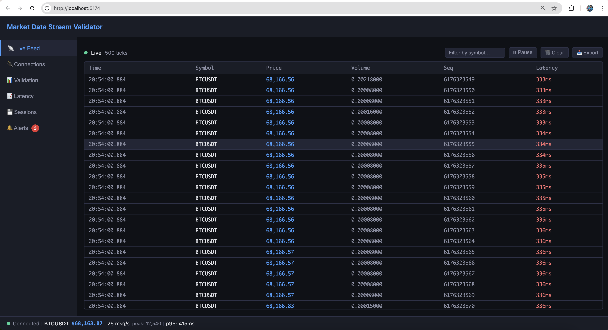
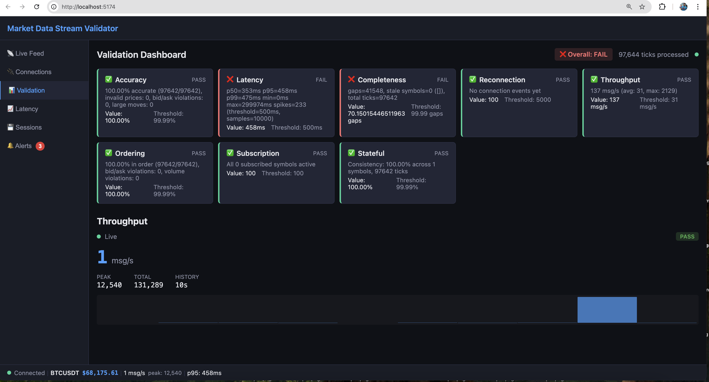
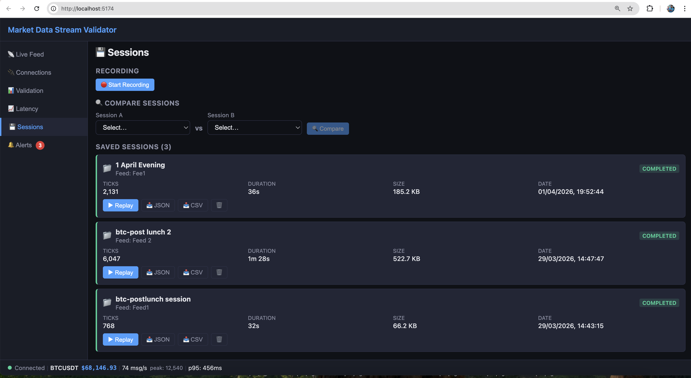
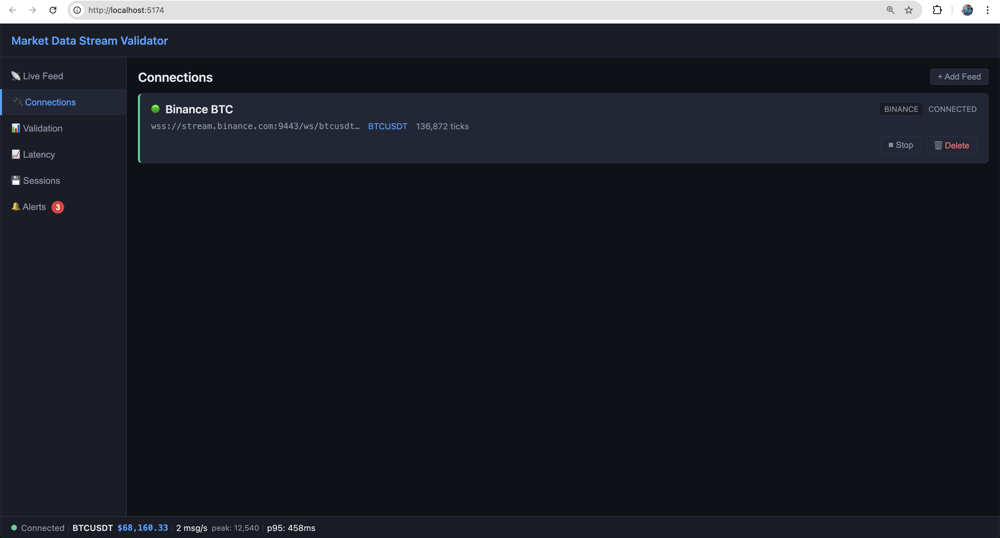

# Market Data Stream Validator

A production-grade real-time market data quality validation system built with **Java 21 LTS**, **Spring Boot 3.3.0**, **React 18**, and **SQLite**. Connects to live WebSocket feeds (Binance, Finnhub, or custom sources), validates streaming data across **8 testing areas**, and presents results through a live dashboard.

## What It Does

```
Exchange WebSocket ──→ Feed Ingestion ──→ BackpressureQueue ──→ 8 Validators ──→ SSE ──→ React Dashboard
                                              │
                                              └──→ SQLite (session recording)
```

| Validation Area | What It Checks |
|----------------|----------------|
| **Ordering** | Ticks arrive in timestamp order per symbol |
| **Accuracy** | Prices valid, bid ≤ ask, no extreme spikes |
| **Latency** | End-to-end latency percentiles (p50/p95/p99) |
| **Completeness** | Sequence gaps, missing data detection |
| **Throughput** | Message rate, drop detection under load |
| **Reconnection** | Auto-reconnect with exponential backoff |
| **Subscription** | Subscribe/unsubscribe correctness |
| **Stateful** | VWAP, OHLC, cumulative volume, stale detection |

## Screenshots

### Live Feed — Real-time BTCUSDT tick stream


### Validation Dashboard — All 8 validators live


### Sessions — Recording, replay, and export


### Connections — Feed management


> All screenshots captured from a live Binance BTCUSDT WebSocket feed.

## Tech Stack

- **Backend:** Java 21 LTS, Spring Boot 3.3.0, WebFlux WebSocket client, JdbcTemplate
- **Frontend:** React 18, Vite 5, SSE (Server-Sent Events)
- **Database:** SQLite (WAL mode, single-connection pool, zero-config)
- **Logging:** Structured JSON via logstash-logback-encoder 7.4
- **Containerization:** Docker multi-stage build
- **Testing:** 603 backend tests (JUnit 5 + Mockito + AssertJ), 185 frontend tests (Vitest + RTL)

## Quick Start

### Prerequisites
- Java 21 LTS
- Node.js 22+
- Maven 3.9+

### Run Locally

```bash
# 1. Start backend (port 8082)
cd backend
export JAVA_HOME=$(/usr/libexec/java_home -v 21)  # macOS only
./mvnw spring-boot:run

# 2. In a separate terminal, start frontend (port 5174)
cd frontend
npm install
npm run dev
```

Open http://localhost:5174 in your browser (Vite proxies `/api` to backend on 8082).

### Feed Manager

Once the backend is running, use the feed manager to check connection status or reconnect:

```bash
python3 feed-manager.py              # Auto-detect & fix (reconnects if stale/disconnected)
python3 feed-manager.py --status     # Just show current feed status
python3 feed-manager.py --reconnect  # Force delete + recreate feed
python3 feed-manager.py --stop       # Stop all feeds
```

### Run with Docker

```bash
docker compose up --build
```

The app will be available at http://localhost:8082.

## API Endpoints

### Feeds
| Method | Endpoint | Description |
|--------|----------|-------------|
| GET | `/api/feeds` | List all feeds |
| POST | `/api/feeds` | Add a new feed |
| DELETE | `/api/feeds/{id}` | Remove a feed |
| POST | `/api/feeds/{id}/start` | Start WebSocket connection |
| POST | `/api/feeds/{id}/stop` | Stop connection |
| POST | `/api/feeds/{id}/subscribe` | Subscribe to symbols |
| POST | `/api/feeds/{id}/unsubscribe` | Unsubscribe from symbols |

### Validation
| Method | Endpoint | Description |
|--------|----------|-------------|
| GET | `/api/validation/summary` | Current validation state (all 8 areas) |
| GET | `/api/validation/history` | Validation result snapshots |
| PUT | `/api/validation/config` | Update thresholds |
| POST | `/api/validation/reset` | Reset all validator state |

### Sessions
| Method | Endpoint | Description |
|--------|----------|-------------|
| GET | `/api/sessions` | List recorded sessions |
| POST | `/api/sessions/start` | Start recording |
| POST | `/api/sessions/{id}/stop` | Stop recording |
| GET | `/api/sessions/{id}/export` | Export as JSON or CSV |
| POST | `/api/sessions/{id}/replay` | Replay through validators |
| DELETE | `/api/sessions/{id}` | Delete session |

### Streaming (SSE)
| Method | Endpoint | Description |
|--------|----------|-------------|
| GET | `/api/stream/ticks` | Live tick stream |
| GET | `/api/stream/validations` | Live validation updates |

### Metrics & Alerts
| Method | Endpoint | Description |
|--------|----------|-------------|
| GET | `/api/metrics` | System metrics (JSON) |
| GET | `/api/alerts` | Active alerts |
| DELETE | `/api/alerts` | Clear alerts |

### Compare Mode
| Method | Endpoint | Description |
|--------|----------|-------------|
| POST | `/api/compare/sessions` | Compare two recorded sessions |

## Supported Feeds

| Adapter | Exchange | Status |
|---------|----------|--------|
| `BinanceAdapter` | Binance (crypto) | Fully implemented |
| `FinnhubAdapter` | Finnhub (stocks) | Fully implemented |
| `GenericAdapter` | Custom JSON feeds | Fully implemented (configurable field mapping) |

## Architecture Highlights

- **BackpressureQueue** — Bounded queue (10K capacity) between ingestion and validation with configurable DROP_OLDEST/DROP_NEWEST policies
- **Sequence-based dedup** — Idempotent tick processing prevents duplicate state updates
- **Memory-safe** — Sliding windows, aggregation counters, bounded violation buffers (< 5 MB for 1000 symbols)
- **Structured observability** — Every validation event logged as searchable JSON with correlation/trace IDs
- **SSRF protection** — Feed URLs validated against internal/private IP ranges
- **Graceful shutdown** — `@PreDestroy` on 4 stateful components (FeedManager, BackpressureQueue, SessionRecorder, StreamController)
- **SQLite WAL mode** — Write-ahead logging + busy_timeout for concurrent read/write safety

## Test Suite

```
Backend:  603 tests (JUnit 5 + Mockito + AssertJ)
Frontend: 185 tests (Vitest + React Testing Library)
Total:    788 tests — ALL PASSING
```

## Bugs Found & Fixed (Phase 1)

| Bug | Root Cause | Fix |
|-----|-----------|-----|
| **Mockito SPI misconfiguration** | Invalid `mock-maker=subclass` in SPI file caused test failures | Removed invalid SPI entry |
| **SpringBootTest + MockBean NullBean** | `FeedManager`'s `@Bean CommandLineRunner` returns null when mocked → `BeanNotOfRequiredTypeException` | Migrated to `@WebMvcTest` slice tests |
| **BackpressureQueue TOCTOU race** | Initial `offer()` outside `synchronized(dropLock)` allowed concurrent threads to steal freed slots | Moved `offer()` inside synchronized block |
| **SessionRecorder not wired** | `onTick()` never called — not registered as `FeedManager` listener | Injected `FeedManager`, registered `this::onTick` in constructor |

## Project Structure

```
backend/
  src/main/java/com/marketdata/validator/
    model/        — Tick, Connection, Session, ValidationResult
    feed/         — BinanceAdapter, FinnhubAdapter, GenericAdapter, FeedConnection, FeedManager
    validator/    — 8 validators + ValidatorEngine + BackpressureQueue
    controller/   — Feed, Validation, Session, Stream, Alert, Compare, Metrics
    store/        — SQLite persistence (TickStore, SessionStore, AlertStore, ConnectionStore)
    session/      — SessionRecorder, SessionReplayer, SessionExporter
    config/       — SqliteConfig
  src/test/java/  — 30+ test classes mirroring main structure

frontend/
  src/
    components/   — ConnectionManager, LiveTickFeed, ValidationDashboard, LatencyChart,
                    ThroughputGauge, SessionManager, AlertPanel, StatusBar
    hooks/        — useSSE (Server-Sent Events hook)
    App.jsx       — Main layout

docs/             — Architecture blueprint, learnings, and phase summaries
```

## Documentation

| Document | Description |
|----------|-------------|
| [Architecture Blueprint](docs/Stream-Validator-Blueprint.md) | Full system design — 16 sections covering all components, data flow, and design decisions |
| [Phase 1 Summary](docs/PHASE1-FINAL-SUMMARY.md) | Complete Phase 1 deliverable checklist with verification results |
| [Learnings](docs/Learnings.md) | Engineering decisions, debugging stories, and key technical insights |
| [AI-Assisted Development](docs/AI-ASSISTED-DEVELOPMENT.md) | Prompt engineering approach used to build this project |

## License

Private project — not for distribution.
